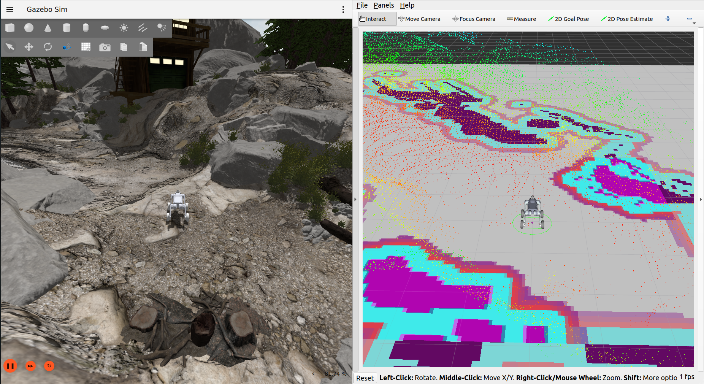
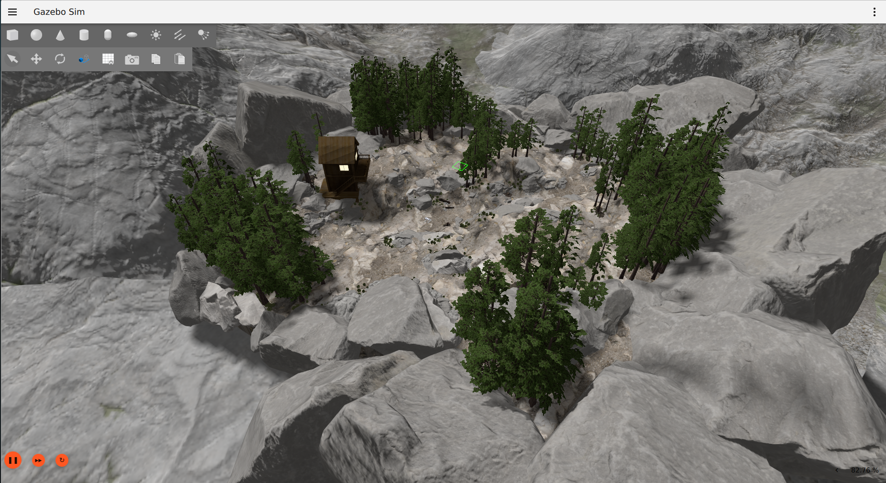
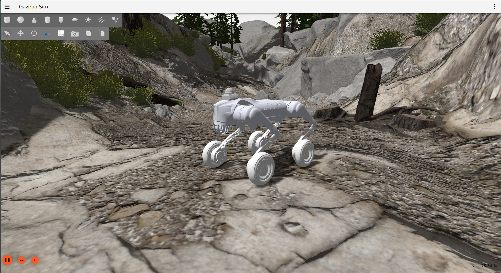
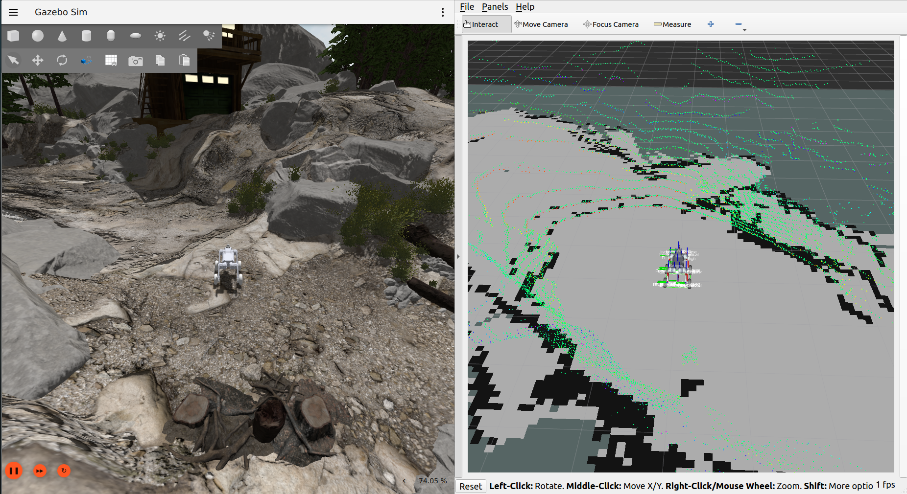
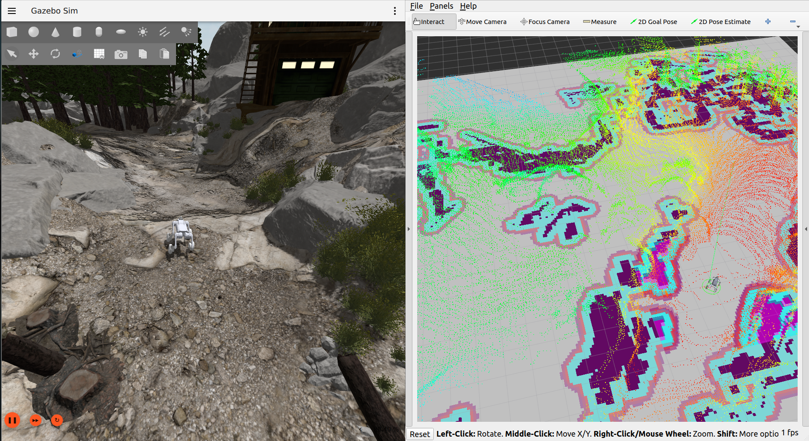
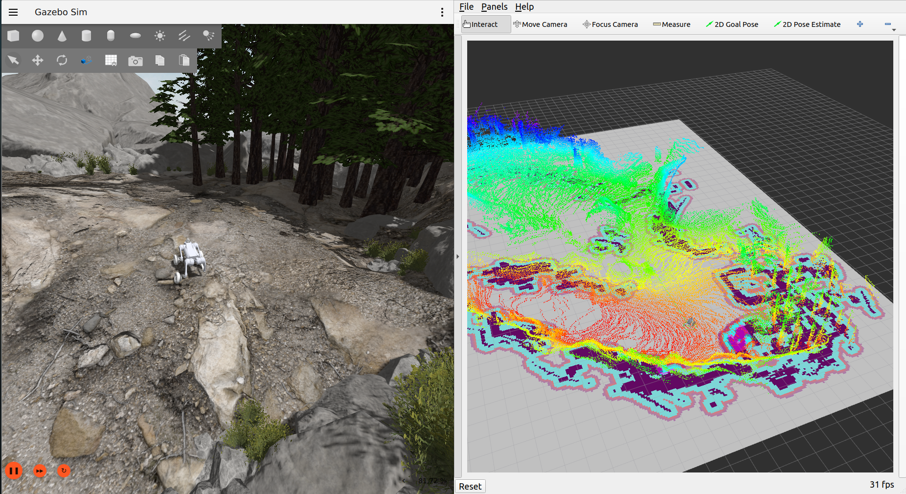

# MAGI: Unitree Go2W in the Rubicon world



A ROS 2 Humble + Gazebo Harmonic simulation of the Unitree Go2W wheeled
quadruped (12 leg joints, 4 drive wheels) on the Rubicon terrain. It includes
`ros2_control` controllers, a stance controller, EKF state estimation, 3D lidar
SLAM with RTAB-Map, and autonomous navigation with Nav2.

| Rubicon world | Go2W on the terrain |
|---|---|
|  |  |

## Quick start

Build the workspace first (see [Build](#build)), then:

```bash
ros2 launch magi_launch magi_test.launch.py
```

This starts Gazebo, spawns the robot, starts the controllers, state estimation
and the stance controller, and opens keyboard teleop and RViz. Use
`gui:=false` or `rviz:=false` to skip either window.

Mapping and navigation:

```bash
# 1. Build a map: drive around with teleop, then Ctrl-C to save it
ros2 launch magi_launch magi_test.launch.py slam:=true

# 2. Navigate on the saved map: set a goal with "2D Goal Pose" in RViz
ros2 launch magi_launch magi_nav.launch.py
```

The simulation stack on its own:

```bash
ros2 launch magi_bringup magi_sim.launch.py teleop:=true
ros2 launch magi_control teleop.launch.py      # teleop in a separate terminal
```

Startup is staged with timers (`spawn_delay`, `controllers_delay`,
`rviz_delay`). The delays are longer with the Gazebo GUI because it has to load
342 MB of terrain first. RViz starts last so that `/robot_description` and
`odom -> base` are already available when it opens.

### Odometry view

`magi_launch/rviz/magi_odometry.rviz` uses `odom` as the fixed frame and the
camera does not follow the robot, so drift is easy to see. It draws two trails:
green is the EKF output (`/odometry/filtered`) and red is raw wheel odometry
(`/wheel_controller/odom`). The red trail drifts off as soon as the robot turns.
Over a test path with two turns:

| Source | Final position | Error |
|---|---|---|
| Ground truth | x +3.23, y +0.55 | - |
| EKF (green) | x +2.47, y +2.01 | 1.65 m |
| Wheel odometry (red) | x +2.73, y +4.51 | 3.98 m |

## Packages

| Package | Contents |
|---|---|
| `magi_description` | URDF/xacro, meshes, `ros2_control` interfaces, Gazebo tags, RViz config |
| `magi_gazebo` | Offline Rubicon world, heightmap rebuild, flat test world |
| `magi_control` | Controller config, spawners, stance controllers, teleop |
| `magi_localization` | EKF, leg odometry, IMU covariance node; publishes `odom -> base` |
| `magi_slam` | RTAB-Map 3D lidar SLAM, map saver, map checks |
| `magi_navigation` | Nav2 configuration and launch for a saved map |
| `magi_bringup` | Simulation stack: world, robot, controllers, estimation |
| `magi_launch` | Top-level launch files (start here) |
| `third_party/gz_ros2_control` | Built from source, see below |

`src/unitree_go2w_ros2` and `src/Rubicon_World` are the original sources, kept
for reference. `unitree_go2w_ros2` has a `COLCON_IGNORE` because its
`go2w_driver` depends on `unitree_sdk2`, which is only for the real robot.

## Build

```bash
cd ~/magi_ws
export GZ_VERSION=harmonic          # required, see below
colcon build --symlink-install
source install/setup.bash
```

### Rubicon world

The world assets are not in the repository (342 MB, and `rubicon.dae` alone is
over GitHub's 100 MB file limit). After cloning, run:

```bash
src/magi_gazebo/scripts/fetch_rubicon.sh   # ~187 MB download, once
colcon build --symlink-install
```

The script downloads and verifies the model, adds terrain friction and rebuilds
the heightmap (see [Heightmap rebuild](#heightmap-rebuild)).

### RTAB-Map

```bash
sudo apt install ros-humble-rtabmap-ros
sudo apt install --only-upgrade ros-humble-diagnostic-updater
```

`diagnostic_updater` 4.0.6 does not include `libdiagnostic_updater.so`, which
rtabmap 0.23.7 needs. Without the upgrade the rtabmap node exits with code 127.

### gz_ros2_control

The Humble binary of `gz_ros2_control` is built for Ignition Fortress and does
not load in Gazebo Harmonic. Its `humble` branch builds against Harmonic when
`GZ_VERSION=harmonic` is set, so it is included in `src/third_party/` and built
from source. Its environment hook sets `GZ_SIM_SYSTEM_PLUGIN_PATH`, so sourcing
the workspace is enough.

---

## Sensors

The sensors follow the real Go2-W specs. They are defined in
[go2w_sensors.xacro](src/magi_description/urdf/go2w_sensors.xacro) and bridged
to ROS in [gz_bridge.yaml](src/magi_gazebo/config/gz_bridge.yaml).

| Real hardware | Simulated as | ROS topic | Rate |
|---|---|---|---|
| Livox MID-360 lidar | `gpu_lidar` | `/lidar/points`, `/lidar/scan` | 10 Hz |
| Front wide-angle camera | `camera` 1280x720 | `/front_camera/image`, `/front_camera/camera_info` | 30 Hz |
| Body IMU (6-axis) | `imu` with noise | `/imu/data_raw` | 200 Hz |
| Foot force sensors x4 | `force_torque` on each wheel joint | `/foot_force/{FL,FR,RL,RR}` | 200 Hz |
| UWB positioning | not modeled | - | - |
| GPS | none (the real robot has none) | - | - |

Checked against the datasheets:

- Lidar: 23,040 points per scan (720 x 32, about 200k points/s like the real
  MID-360), 360° x (-7° to +52°), 0.1-40 m range, 2 cm noise.
- Camera: 120° horizontal FOV, optical frame following REP-103.
- IMU: reads 9.82 m/s² at rest, with the configured noise model active.
- Foot forces: the load distribution matches the calf joint torques.

Limitations:

- The real MID-360 uses a non-repetitive rosette scan pattern. `gpu_lidar` only
  supports a uniform raster, so FOV, range, rate and point count match but the
  point distribution does not. This matters for Livox-specific SLAM packages,
  not for general lidar SLAM.
- The camera is a pinhole camera instead of a fisheye, because no lens model is
  published for the real one.
- Foot forces are reported in the calf frame. The wheel frame spins with the
  wheel (about 11.6 rad/s while driving), so readings in that frame would rotate
  too.

---

## State estimation

A `robot_localization` EKF in [magi_localization](src/magi_localization/)
publishes `odom -> base`. `diff_drive_controller` runs with
`enable_odom_tf: false`, so the EKF is the only publisher of that transform.

The main reason for the EKF is heading. The wheels cannot steer, so the robot
slides them sideways in every turn, and wheel odometry (which computes yaw from
the left/right speed difference) overestimates the rotation:

| Maneuver | Ground truth | Wheel odometry | EKF |
|---|---|---|---|
| Spin 0.5 rad/s, 8.8 s | 118.1° | 197.6° (+67%) | 124.1° (+5%) |
| Arc 0.5 m/s + 0.4 rad/s, 7.1 s | 64.2° | 121.9° (+90%) | 60.2° (-6%) |

```bash
ros2 run magi_localization magi_yaw_compare.py --angular 0.5 --duration 8
```

Fused inputs:

- Wheel odometry: `vx` only.
- IMU: roll, pitch, and all three angular rates.

Yaw comes only from the gyro, as on the real robot (its IMU has no
magnetometer), so it drifts slowly. SLAM corrects this in the `map` frame. `vy`
is not fused as zero because the robot is skid-steered and really does slide
sideways in turns.

### Height from leg kinematics

Fusing the accelerometer (`az`) without any height measurement makes `z` drift
quickly, because the accelerometer bias gets integrated twice. With the robot
standing still for about 40 s:

| Inputs | z after ~40 s |
|---|---|
| IMU only | -107.96 m |
| IMU + leg kinematics | 0.010 m |

With the IMU alone, `vz` grew at 0.098 m/s², which matches the 0.1 m/s²
accelerometer bias set in the URDF.

`magi_leg_odometry` provides the missing height measurement. For each wheel in
contact (detected with the foot force sensors), body height above the ground is
`h = wheel_radius - (R * t_i).z`, where `t_i` is the axle position from TF and
`R` uses roll and pitch only (yaw does not change the z component). On rough
terrain it measured 0.3877 m against a ground truth of 0.3963 m, and a
commanded 0.123 m crouch was measured as 0.123 m.

| Topic | Content |
|---|---|
| `/magi/terrain_height` | Body height above the contact plane |
| `/magi/contacts` | Which feet are in contact |
| `/magi/leg_twist` | `vz`, fused by the EKF as `twist0` |

This height is relative to the ground under the robot, so `odom` z does not
follow absolute elevation when driving up a slope. It does keep `z` bounded,
which is what the filter needs.

### IMU covariance

`gz.msgs.IMU` has no covariance fields, so `/imu/data_raw` from the bridge has
all covariances set to zero, which `robot_localization` treats as perfect
measurements. `magi_imu_covariance` republishes it on `/imu/data` with the noise
values from the URDF (gyro 4.0e-8, accel 2.89e-4) and sets a large yaw variance
(1e6), since yaw is not actually measured.

---

## 3D SLAM

RTAB-Map ([magi_slam](src/magi_slam/)) builds a 3D map from the lidar and
publishes `map -> odom`. The EKF still publishes `odom -> base`.

```bash
ros2 launch magi_launch magi_test.launch.py slam:=true
```



Configuration notes:

- RTAB-Map uses the EKF output (`/odometry/filtered`) as its odometry.
  `icp_odometry` is not used because it would also publish `odom -> base`.
- Registration is 6-DoF (`Reg/Force3DoF: false`). The terrain has about 5 m of
  height difference, and odom z does not follow it.
- Run only one `rtabmap` instance at a time. Two instances both publish
  `map -> odom`, and the map frame then jumps between two positions.

### Map height

RTAB-Map places the `map` origin at the pose of its `frame_id` when the first
keyframe is added. With `frame_id: base`, z = 0 of the map was at body height,
about 0.35 m above the ground, and the 2D occupancy grid (always drawn at z = 0)
showed up in RViz above the robot's wheels. The 3D cloud itself was correct:
ground points were within 3 cm of the true terrain.

This is fixed in two places:

- `magi_leg_odometry` sets the EKF's z once at startup (via `/set_pose`) after
  the robot has settled, so z = 0 in `odom` is the ground. Disable with
  `set_ground_datum:=false`.
- RTAB-Map uses `base_footprint` as its `frame_id`: a fixed link 0.36 m below
  `base`. It is fixed instead of following the measured ride height because SLAM
  needs a frame that is rigidly attached to the robot.

With both changes the grid is within 1 mm of the wheel contacts when standing,
and 38 mm off after 9 m of driving (odom z drift, which loop closure corrects).

### Accuracy

Over a 6 s drive across the basin:

| Source | Distance | Error |
|---|---|---|
| Ground truth | 1.810 m | - |
| SLAM (`map -> base`) | 1.846 m | +0.036 m |
| EKF only (`odom -> base`) | 2.198 m | +0.387 m |

SLAM reduces the position error about ten times. Yaw error barely changes on a
run this short (-7.3° vs -8.1°) because there is no loop closure yet.

---

## Mapping and navigation



### Saving the map

RTAB-Map writes its database continuously while mapping, and the launch file
points it directly at the final location, so stopping the launch saves the map.
`magi_map_saver` runs alongside and, on Ctrl-C, exports the files Nav2 needs:

```
~/magi_maps/rubicon.db      RTAB-Map database (used for localization)
~/magi_maps/rubicon.yaml    2D occupancy grid (+ .pgm) for Nav2
~/magi_maps/rubicon.ply     3D point cloud
```

To save without stopping:

```bash
ros2 service call /magi_map_saver/save std_srvs/srv/Trigger
```

The map saver handles SIGINT itself (`SignalHandlerOptions.NO`). With rclpy's
default handler, Ctrl-C shut down the context while the executor was waiting,
which raised an `RCLError` and the map was never written.

### Managing maps

By default every mapping run uses the name `rubicon`, so a new run replaces the
previous map. The database is cleared when rtabmap starts (about 45 s after
launch), not when you stop it, so even a short run that you quit right away
removes the old map.

```bash
# New map under a different name (the rubicon map is left untouched)
ros2 launch magi_launch magi_test.launch.py slam:=true map_name:=rubicon2
ros2 launch magi_launch magi_nav.launch.py map_name:=rubicon2      # navigate on it

# Extend the existing map instead of starting over
ros2 launch magi_launch magi_test.launch.py slam:=true delete_db:=false

# Back up the current maps before experimenting
cp -a ~/magi_maps ~/magi_maps_backup_$(date +%F)
```

When extending a map, RTAB-Map only joins the new session to the old one after a
loop closure, i.e. once it recognizes a place it has already mapped. Start from
the usual spawn point and drive over mapped ground first; if the two sessions
never connect, the result is two overlapping maps. Use `map_dir:=<path>` to
store maps somewhere other than `~/magi_maps`.

### Navigation

```bash
ros2 launch magi_launch magi_nav.launch.py
```

This starts RTAB-Map in localization mode on the saved map, plus Nav2 (map
server, NavFn planner, Regulated Pure Pursuit controller, behavior tree
navigator). Set a goal with 2D Goal Pose in RViz.

- AMCL is not used. RTAB-Map localizes against the saved map and publishes
  `map -> odom`. The robot spawns where the map was started, so the initial pose
  is already correct (within about 4 cm). If localization is lost, use 2D Pose
  Estimate in RViz, which RTAB-Map receives on `/initialpose`.
- The controller is Regulated Pure Pursuit instead of DWB. `magi_stabilizer`
  limits the velocity on rough ground, so the robot often moves slower than Nav2
  asks. DWB scores trajectories assuming the command is followed exactly; Pure
  Pursuit only tracks the path, so it copes with this better.
- Teleop is off by default (`teleop:=true` to enable), because teleop and Nav2
  both publish on `/cmd_vel`.

### Lidar ground coverage

The MID-360 is mounted 0.46 m above the ground and its lowest beam points 7°
down, so it sees very little ground near the robot. In one scan on Rubicon only
1.6% of the 23,040 points were within 0.3 m of ground level, and the closest one
was 1.52 m away. This caused two problems.

**Occupancy grid.** By default RTAB-Map marks a cell free only when a ground
point lands in it. With so few ground points, most cells came out occupied or
unknown, including the ones the robot had driven over. `Grid/RayTracing: true`
marks the cells along each beam as free instead. On a 28 m mapping run, checked
at the 88 poses the robot actually drove through:

| | Ray tracing off | Ray tracing on |
|---|---|---|
| Driven cells marked free | 51% | 100% |
| Driven cells marked occupied | 34% | 0% |
| Largest drivable area (0.38 m robot radius) | 1.4 m² | 364 m² |

Without ray tracing the robot's own start cell was blocked, so Nav2 could not
plan at all. Compared with the real terrain, the old map's free and occupied
cells were about equally drivable (72.8% vs 70.9%), so it did not contain useful
information. With ray tracing, occupied cells line up with steeper terrain
(90th percentile slope 51° vs 33° for free cells). `Grid/RangeMax` was also
reduced from 20 m to 10 m, since long beams are more likely to pass over dips
and mark them as free.

**Live obstacle layer.** Nav2's obstacle layer needs ground points to clear free
space. Using `rtabmap_util/obstacles_detection`, almost the whole cloud was
classified as obstacles with every setting tried:

| Settings | Obstacle points/scan | Ground points/scan |
|---|---|---|
| Noise filter 0.05 m | 5 | 0 |
| No noise filter | 1379 | 0 |
| rtabmap defaults | 2615 | 0 |
| Height segmentation, ground below 0.3 m | 3263 | 224 |

With this layer enabled, the robot marked the terrain around itself as
obstacles and stopped. It is disabled by default (`local_obstacles:=true` to
enable), and Nav2 uses only the saved map. Note that
`Grid/NoiseFilteringRadius` has to be larger than `Grid/CellSize`: with 0.05 m
on a 0.1 m grid, every point was filtered out without any warning.

### Slope layer

An occupancy grid has no notion of slope, and in testing Nav2 planned routes
over steep ground where the robot then tipped over. `magi_map_saver` therefore
adds a slope layer when it saves the map: it takes the lowest point in each cell
of the 3D cloud as the ground height, computes the slope over a 1.5 m window,
and marks cells above the limit as occupied.

The estimate is rough (correlation 0.54 with the true terrain, since ground
points are sparse), so the limit was tuned against five places where the robot
rolled over during testing and against the path it drove without problems:

| Limit / window | Occupied | Driven path still drivable | Largest area | Tip-over spots blocked |
|---|---|---|---|---|
| None (`slope_layer:=false`) | 2.5% | 94.9% | 313 m² | 0 of 5 |
| 25° / 1.0 m | 29.2% | 67.9% | 66 m² | 5 of 5 |
| 35° / 1.5 m (default) | 19.3% | 69.2% | 138 m² | 4 of 5 |
| 40° / 1.5 m | 15.9% | 69.2% | 179 m² | 4 of 5 |

Without the slope layer none of the five spots are blocked. The default blocks
four of them while keeping about twice the drivable area of the 25° setting.
The 35° value is a tuned threshold for this smoothed estimate; the robot itself
tips at around 25°.

### Results



14 goals were sent on `/goal_pose` (the same topic the RViz tool uses):

| | |
|---|---|
| Goals reached | 10 of 14 |
| Longest run without failure | 6 of 6 goals, robot upright at the end |
| Typical goal | 3-7 m, reached in 7-26 s |
| Planning / localization failures | 0 / 0 |

All four failures were the robot tipping over or getting stuck on terrain.

---

## Control

`gz_ros2_control` runs the `controller_manager` inside Gazebo; the launch files
only start the spawners.

| Controller | Type | Joints |
|---|---|---|
| `joint_state_broadcaster` | JointStateBroadcaster | all 16 |
| `imu_sensor_broadcaster` | IMUSensorBroadcaster | body IMU |
| `leg_controller` | JointTrajectoryController | 12 leg joints, effort |
| `wheel_controller` | DiffDriveController | 4 wheels, velocity, skid-steer |

Each joint has only one command interface. `GazeboSimSystem::write()` checks
velocity, then position, then effort, and only uses the first one it finds.

The legs are effort controlled: `joint_trajectory_controller` computes
`tau = p*(q_des - q) + i*integral + d*(dq_des - dq)`, the same control law the
Unitree motors use (`MotorCmd`: q, dq, tau, kp, kd). With the calf's 0.1535 m
lever, `p = 200` gives about 8500 N/m of stiffness at the wheel, or 5.7 mm of
compression under the per-leg load, close to the terrain's 6.8 mm average step.
Compared with position control, the load is shared much more evenly between the
legs (calf effort on Rubicon):

| Max/min spread | Position control | Effort control |
|---|---|---|
| Standing | 201x (FL wheel barely touching) | 10.2x |
| Driving | - | 3.3x |

### Stance controller and velocity governor

```bash
ros2 launch magi_launch magi_test.launch.py                            # magi_stabilizer
ros2 launch magi_launch magi_test.launch.py stance_controller:=balance # magi_balance
ros2 launch magi_launch magi_test.launch.py balance:=false             # fixed stance
```

`magi_stabilizer` is the default. `magi_balance` (the earlier controller) and
`magi_posture` (fixed stance) are kept for comparison.

`magi_stabilizer` also filters velocity commands. Teleop and Nav2 publish on
`/cmd_vel`, and the stabilizer forwards them to
`/wheel_controller/cmd_vel_unstamped` after limiting them to what the robot can
currently handle. A turn at `(v, w)` needs `v*w` of lateral acceleration; the
allowed value is found by searching the current stability margin, so it drops
automatically on side slopes, over bumps, or when a wheel loses contact. `v` and
`w` are scaled by the same factor, so the robot keeps the commanded turning
radius and just drives it slower. Nothing else should publish to
`/wheel_controller/cmd_vel_unstamped` while it runs.

Stability is measured as a force-angle margin: how far the total force (gravity
plus accelerations, as measured by the accelerometer) can rotate before the
robot tips over its weakest support edge. Unlike a "CoP inside the support
polygon" test, it still works with only two wheels on the ground. On Rubicon,
8 s runs:

| Command | `magi_balance` | `magi_stabilizer` |
|---|---|---|
| v 0.7 | 2/3 upright, roll 45° | 3/3, roll 11° |
| v 1.2 | 0/3 upright, roll 137° | 8/8, roll 9° |
| v 0.9, w 0.5 | 1/3 upright, roll 99° | 3/3, roll 11° |
| v 1.5, w 1.2 | 1/3 upright, roll 85° | 7/8, roll 12° |
| Total | 4/12 | 21/22 |

There is no stepping, so a large enough terrain disturbance can still tip the
robot over.

### Stabilizer fixes

The first working version of the stabilizer covered only 1.07 m per 8 s run on
the terrain course, kept the legs fully spread and limited the speed almost
everywhere. These problems were found and fixed (details are in the comments of
`magi_stabilizer.py` and `magi_stabilizer.yaml`):

| # | Problem | Symptom |
|---|---|---|
| 1 | Unfiltered rate feedback in the attitude loop | 19.5 Hz oscillation while standing; accelerometer readings up to ±200 m/s² |
| 2 | Sign error in the effective gravity vector (`-down*G`) | Stability envelope search always failed; lateral acceleration fixed at 0.8 m/s² instead of ~10 |
| 3 | Terrain preview fitted a plane, so slopes counted as roughness | 57% of the map treated as rough; now uses a quadratic fit |
| 4 | Urgency always at 1.0 | Legs always spread, speed capped at 0.35 m/s |
| 5 | Stance widening triggered by normal driving speed | Track wider than 0.50 m for 98% of the course |
| 6 | Stance changes attempted while stopped | Front hips saturated at 23.7 N·m; loaded wheels cannot slide sideways |

- **1:** There is about 180° of phase lag below 20 Hz through the trajectory
  controller and hip PD, so the unfiltered rate term amplified oscillations
  instead of damping them. The shaking also corrupted the accelerometer data the
  rest of the controller uses (the stability margin read -32° on an upright
  robot). With filtering and `kd = 0.05`, body rates at rest are 0.007 rad/s rms.
- **5:** Reducing `widen_max` from 0.110 to 0.070 actually increased the median
  tip margin (31.3° to 35.6°), because at full spread the wheels tilt about 24°
  and lose contact area. On flat ground at 0.97 m/s the track went from
  0.554 m to 0.443 m and the ride height from 0.290 m to 0.346 m.
- **6:** Sliding loaded wheels sideways needs about 17.3 N·m at the hip, on top
  of ~12 N·m to hold the spread, against a 23.7 N·m limit. Stance changes now
  only happen while the robot is rolling.
- **Pitch guard (added):** the pitch tipping angle is `atan(0.1934/0.311)` =
  31.9°, and widening the stance does not help with it. The robot flipped
  backwards on steep faces, so `_govern` now limits commands based on pitch and
  pitch rate.

### Startup

With an effort interface, the legs have no torque until `leg_controller` is
active ([gz_system.cpp:476](src/third_party/gz_ros2_control/src/gz_system.cpp#L476)),
so the robot sags briefly after spawning. The PD controller then lifts it back
to the 0.396 m stance. Two alternatives were tried and dropped: a constant
gravity-compensation torque (the stance is unstable without feedback, so it
diverged), and starting the simulation paused (controller activation needs
simulation time, which caused a race). `paused:=true` is still available.

---

## Mobility tests

All results use Gazebo ground truth. Use `--reps` on terrain: the same start
pose has given 2.7 m in one run and 5.4 m in the next, while flat ground varies
by only 0.2 m (sd).

`magi_terrain_trial.py` runs a 12-leg course: nine start poses across Rubicon
(slopes 3° to 23°) plus two arcs and a spin. It reports net displacement rather
than path length, since shaking in place adds path length without progress.
Three passes, 8 s per leg:

| Configuration | Net displacement | Path | Upright at end |
|---|---|---|---|
| Before the stabilizer fixes | 1.07 m | 1.54 m | 28/31 |
| Stabilizer fixes, 8-bit terrain | 1.52 m | 1.81 m | 19/21 |
| Stabilizer fixes, rebuilt terrain | 3.23 m | 3.68 m | 18/29 |
| Same, `ride_height` 0.36 (default) | 2.57 m | 3.08 m | 9/11 |

The default `ride_height` gives up some distance for a better upright rate (see
`magi_stabilizer.yaml`; the last row is a single pass). Rollovers per run went
up after the fixes because the robot now gets further, including to the two
start poses with boulders within 1 m. On flat ground it reaches 0.98 m/s of a
1.00 m/s command.

```bash
ros2 run magi_control magi_terrain_trial.py --duration 8 --reps 3
ros2 run magi_control magi_drive_benchmark.py 1.0 0.0 3.5 --reps 8 \
    --reset-world rubicon --reset-pose 3.0,-0.5,1.85
```

Notes:

- Run only one stance controller at a time. A leftover `magi_posture` process
  next to `magi_stabilizer` sends conflicting leg commands, and the robot then
  looks like it can barely move.
- The wheel collision shape has a big effect. The upstream model uses the wheel
  visual mesh for collision; `gen_body.py` replaces it with a cylinder. With the
  mesh, spinning at 0.8 rad/s saturated the hips and collapsed the legs; with
  the cylinder, 1.5 rad/s works fine.

---

## Known limitations

- **No self-righting.** Once the robot tips over it cannot recover, which ends
  the navigation session. All four failed navigation goals were tip-overs or the
  robot getting stuck. The slope layer helps (it blocks 4 of 5 known tip-over
  spots) but does not prevent it completely.
- **No live obstacle detection.** The lidar cannot see anything lower than about
  0.4 m within 2.7 m of the robot, and the obstacle layer is disabled (see
  [Lidar ground coverage](#lidar-ground-coverage)). Navigation relies on the
  saved map, which works for this static world but not with moving obstacles.
- **Turning.** With fixed wheels the robot gets about 78% of the commanded yaw
  rate on flat ground and 47% on terrain, and wheel odometry overestimates yaw.
  Raising `wheel_separation_multiplier` in `magi_controllers.yaml` makes turning
  more responsive at the cost of odometry accuracy.
- **Speed on terrain.** 0.6-0.8 m/s over Rubicon vs 0.98 m/s on flat ground,
  because of the governor's roughness limit and about 24% wheel slip.
- **Friction.** The robot can lift its front wheels if
  `mu > half_wheelbase / h_com` = 0.62, but climbing needs `mu` = 1.0, which is
  why there is a pitch guard. `mu` should also stay below about 1.23 so that
  sideways wheel forces do not exceed the hip torque limit.
- **Physics engine.** dartsim uses a single isotropic friction coefficient, so
  `mu2` and `fdir1` have no effect. `bullet-featherstone` (`physics_engine:=`)
  cannot load the Rubicon world and only works with `flat.sdf`.

Tried without improvement: wheel friction 1.4 instead of 1.0; mesh, cylinder and
sphere wheel collision; position vs effort control on the legs; command speeds
0.2-1.0 m/s; the `bullet` collision detector in dartsim (worse); and
`open_loop_control` on `leg_controller` (50 Hz roll oscillation on terrain).
Tune controllers on `world:=flat.sdf` first, then check on terrain.

---

## Offline world

The world file uses `model://Rubicon` from `magi_gazebo/models/Rubicon`, which a
colcon hook adds to `GZ_SIM_RESOURCE_PATH`, so nothing is downloaded at run time.
`fetch_rubicon.sh`:

- downloads with retry/resume and checks the archive with `unzip -t` (a plain
  `curl` of the Fuel URL can stop early and leave a corrupt file),
- adds a friction value (`mu` 1.5) to the heightmap collision, which has none
  upstream (this raised driving speed from 16% to 28% of the command at the
  time),
- rebuilds the heightmap (below).

### Heightmap rebuild

The original `Heightmap.png` is 8-bit over 5 m of height, so each grey level is
19.6 mm and the terrain surface is made of small steps. The average step between
neighboring cells is 15.6 mm, about one level.

For the 86 mm wheels this is significant: climbing a step of height `h` with
wheel radius `r` needs a traction coefficient of `sqrt(2rh - h²)/(r - h)`, which
is 0.82 at 19.6 mm (the friction coefficient is 1.0). The steps slow the robot
down and cause the jolts that tip it over.

[`rebuild_heightmap.py`](src/magi_gazebo/scripts/rebuild_heightmap.py) smooths
out the steps while keeping every sample within half a grey level of its
original value (Laplacian smoothing, clamped after each iteration), then
upsamples to 1025x1025 and saves it as 16-bit:

| | Resolution | Mean step | Median slope |
|---|---|---|---|
| Original, 8-bit | 513² (7.3 cm cells) | 15.6 mm | 15.0° |
| Rebuilt, 16-bit | 1025² (3.7 cm cells) | 6.7 mm | 11.6° |

No sample moves more than 9.8 mm, so objects placed on the terrain stay where
they were. The original PNG is kept and only `model.sdf` points to the new file.
On the mobility course this raised net displacement from 1.52 m to 3.23 m per
leg.

---

## Model notes

- `go2w_body.xacro` is generated from the upstream URDF by
  `magi_description/scripts/gen_body.py`. It updates the mesh paths, removes
  duplicate `<material>` tags, and replaces the wheel collision mesh with a
  cylinder (r 0.086 m, width 0.0518 m). Kinematics, inertia and visuals are
  unchanged.
- `mid-360.dae` crashed the Gazebo GUI when the robot spawned. The file uses the
  same `offset` for VERTEX and NORMAL, which is valid COLLADA but not handled by
  gz-common5's loader (it reads past the end of the index array). The headless
  server does not load visual meshes, so only the GUI was affected.
  `fix_collada_offsets.py` rewrites the file and has already been applied to
  the included meshes:

  ```bash
  python3 src/magi_description/scripts/fix_collada_offsets.py src/magi_description/meshes/*.dae
  ```

## Troubleshooting

- **`package 'rtabmap_slam' not found`:** install RTAB-Map (see
  [Build](#rtab-map)).
- **RViz fails with `undefined symbol: __libc_pthread_init`:** this happens when
  launching from a snap-packaged terminal such as VS Code's, which sets
  `GTK_PATH`/`LOCPATH` to snap paths. The launch files clear these for RViz.
  When running `rviz2` by hand, prefix it with
  `GTK_PATH= LOCPATH= GIO_MODULE_DIR=`.

Useful commands:

```bash
ros2 launch magi_description display.launch.py     # RViz + joint sliders, no Gazebo
ros2 control list_controllers
ros2 topic echo /joint_states
```
